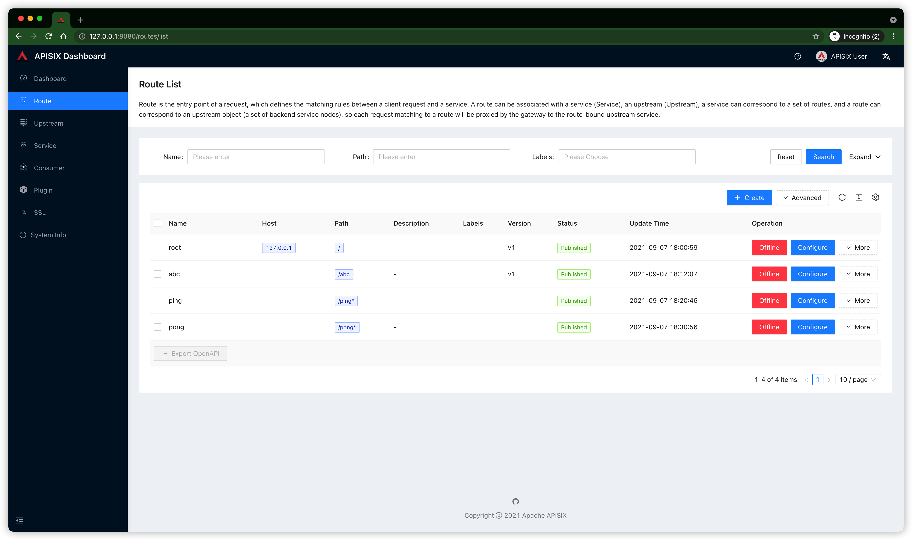

# API-Six


## install  k8s v1.20.2  using minikube


```
mk start --kubernetes-version=v1.20.2
```


## helm install apisix and apisix dashboard 2.7

```
helm repo add apisix https://charts.apiseven.com
helm repo update


```
```
helm install apisix apisix/apisix

```
```

helm install apisix-dashboard apisix/apisix-dashboard

```

##  hands-on on apisix-dashboard





##  Ref:

https://github.com/latermonk/minikube-in-action/blob/main/minikube-in-action.md


